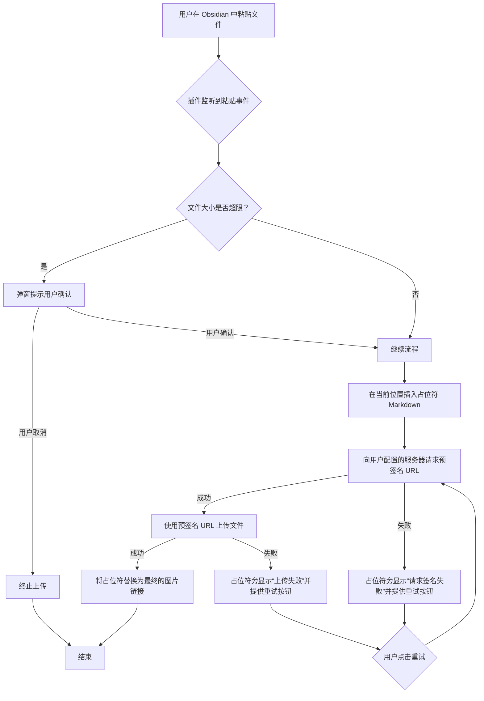

# Obsidian S3-Bridge

将粘贴的图片与文件自动上传到兼容 S3 的对象存储（AWS S3 / Cloudflare R2 / MinIO 等），并在笔记中插入可访问链接。提供上传占位、失败重试、尺寸阈值校验、自定义对象键等能力，专为 Obsidian 编辑体验优化。

## 安装

### 推荐：通过 BRAT 安装

1.  **安装 BRAT 插件**:
    - 在 Obsidian 的社区插件市场中搜索 `Obsidian 42 - BRAT` 并安装。
    - 在设置中启用 BRAT 插件。
2.  **添加本插件**:
    - 打开 BRAT 的设置（通过命令面板输入 `BRAT` 或在设置中找到）。
    - 点击 "Add Beta plugin"。
    - 输入本插件的仓库地址：`solider245/obsidian-s3-bridge`
    - BRAT 会自动下载最新版本的插件。
3.  **启用插件**:
    - 在 Obsidian 设置 -> 社区插件中启用 "Obsidian S3-Bridge"。

### 手动安装

1.  从 [Releases](https://github.com/solider245/obsidian-s3-bridge/releases/latest) 页面下载最新的 `main.js`, `manifest.json`, `styles.css` 文件。
2.  在你的 Obsidian 库中，进入 `.obsidian/plugins/` 目录。
3.  创建一个名为 `obsidian-s3-bridge` 的新文件夹。
4.  将下载的三个文件复制到该文件夹内。
5.  重启 Obsidian，然后在设置 -> 社区插件中启用 "Obsidian S3-Bridge"。

### 快速开始

1.  **配置存储服务**：
    - AWS S3: 需要访问密钥 ID、秘密访问密钥、区域和存储桶名称
    - Cloudflare R2: 需要账户 ID、访问密钥 ID、秘密访问密钥和存储桶名称
    - MinIO: 需要端点 URL、访问密钥 ID、秘密访问密钥和存储桶名称

2.  **测试上传**：
    - 复制一张图片到编辑器中，应该自动上传并替换为链接
    - 或者使用命令面板中的 "Upload file to S3" 命令

3.  **查看状态**：
    - 上传进度会显示在状态栏
    - 完成后会显示成功通知

## 核心功能

### 🚀 基础上传功能

- **粘贴即上传**：在编辑器中粘贴图片或文件，插件会自动将其上传到你配置的 S3 存储桶，并用外链替换。
- **预签名直传**：采用安全的预签名 URL (Presigned URL) 方式上传，你的访问密钥 (Secret Key) 无需保存在插件中，保障了账户安全。
- **乐观占位符**：上传过程中，笔记中会先插入一个临时的占位符，上传成功后自动替换为最终链接，避免了漫长的等待。
- **失败一键重试**：如果上传失败，占位符旁边会提供一个"重试"按钮，点击即可重新上传，无需再次粘贴。

### 📦 批量上传功能

- **多文件同时上传**：支持一次性选择多个文件进行批量上传，大幅提升上传效率。
- **并发控制**：可自定义最大并发上传数量，平衡上传速度和系统资源使用。
- **队列管理**：提供完整的上传队列管理，支持暂停、恢复、取消等操作。
- **进度跟踪**：实时显示每个文件的上传进度和总体上传状态。

### 🎯 拖拽上传功能

- **编辑器拖拽**：支持直接拖拽文件到编辑器进行上传，提供直观的拖拽体验。
- **视觉反馈**：拖拽过程中提供实时的视觉反馈，包括拖拽区域高亮和提示信息。
- **智能识别**：自动识别拖拽的文件类型，过滤不支持的文件格式。

### 📊 智能进度反馈

- **实时速度计算**：精确计算上传速度，包括当前速度、平均速度和峰值速度。
- **剩余时间估算**：基于当前上传速度智能估算剩余时间，提供准确的时间预期。
- **可视化进度条**：美观的进度条设计，支持渐变色彩和动画效果。
- **详细统计信息**：显示上传的详细统计信息，包括文件数量、总大小、已上传大小等。

### 🔔 智能通知系统

- **防打扰机制**：智能控制通知频率，避免通知轰炸，提供更好的用户体验。
- **分类通知**：根据上传状态提供不同类型的通知（开始、进行中、完成、错误）。
- **可配置选项**：支持自定义通知的显示方式、频率和内容。
- **错误详情**：失败时提供详细的错误信息和重试建议。

### ⚙️ 配置向导

- **新手引导**：为新用户提供分步配置引导，简化初始设置过程。
- **服务商模板**：内置主流云存储服务商的配置模板，一键应用。
- **实时验证**：配置过程中实时验证输入信息的正确性。
- **连接测试**：提供连接测试功能，确保配置正确可用。

### 🎨 增强的设置界面

- **分类设置**：设置选项按功能分类，便于查找和管理。
- **实时预览**：设置更改后实时预览效果。
- **详细说明**：每个设置选项都提供详细的使用说明和建议。
- **默认值优化**：提供经过优化的默认设置，开箱即用。

### 🔧 高级功能

- **灵活的命名规则**：你可以自定义文件的存储路径和名称，例如按年/月/日创建文件夹，或使用随机字符串命名。
- **上传前校验**：可以设置文件大小阈值，当粘贴的文件超过该大小时，插件会弹出提示，由你决定是否继续上传。
- **多配置 Profile**：支持保存多套 S3 配置方案，方便你在不同的存储服务或场景间快速切换。
- **离线缓存支持**：利用 HTTP `Cache-Control` 头，让已加载过的图片在离线状态下也能正常显示。
- **重试机制**：智能的重试机制，支持自定义重试次数和延迟策略。

## 支持的服务

本插件兼容所有支持 S3 标准协议的对象存储服务，包括但不限于：

- Amazon Web Services (AWS) S3
- Cloudflare R2
- MinIO
- Backblaze B2
- DigitalOcean Spaces
- Wasabi
- 以及其他自建的 S3 兼容服务

## 快速开始

1.  **安装并启用插件** (参见上文的安装步骤)。
2.  **进入插件设置**: 打开 Obsidian 设置，找到 "Obsidian S3-Bridge"。
3.  **创建配置 Profile**:
    - 在 "Profiles" 部分，给你的配置起一个名字 (例如 `my-r2-bucket`)。
    - 填写你的 S3 配置信息 (Endpoint, Bucket, Region, Access Key ID, Secret Access Key)。
    - 点击 "Save Profile"。
4.  **激活 Profile**: 在 Profile 列表中，点击你刚创建的 Profile 右侧的 "Activate" 按钮。
5.  **测试上传**: 回到编辑器，粘贴一张图片。你会看到一个占位符，稍等片刻后，它会自动变成一个可访问的图片链接。

## 工作流

下图展示了从粘贴文件到生成链接的完整过程：

## 详细配置

插件的所有配置都在设置页面的 "Obsidian S3-Bridge" 中完成。

### Profile 管理

本插件支持多套独立的配置 (Profile)，方便你在不同的存储桶、服务商或场景之间切换。

- **创建 Profile**: 在 "Create New Profile" 表单中，输入 Profile 名称和所有必需的 S3 参数，然后点击 "Save Profile"。
- **激活 Profile**: 在 "Profiles" 列表中，找到你想要使用的 Profile，点击其右侧的 "Activate" 按钮。当前激活的 Profile 会有高亮标记。
- **编辑/删除 Profile**: 你可以随时点击 "Edit" 来修改已有 Profile，或点击 "Delete" 将其删除。

### 参数详解

以下是每个配置项的详细说明：

| 字段                  | 说明                                                        | 示例                                                  |
| --------------------- | ----------------------------------------------------------- | ----------------------------------------------------- |
| **Profile Name**      | 为这套配置起一个易于识别的名称。                            | `my-work-bucket`                                      |
| **Endpoint**          | 你的 S3 兼容服务的 API 端点。                               | `https://s3.us-west-004.backblazeb2.com`              |
| **Region**            | 存储桶所在的区域。                                          | `us-west-004`                                         |
| **Bucket**            | 你要上传到的存储桶名称。                                    | `my-obsidian-vault`                                   |
| **Access Key ID**     | 访问凭证的 ID。                                             | `004a1b2c3d4e5f6a7b8c9d0e`                            |
| **Secret Access Key** | 访问凭证的密钥。**此密钥仅保存在你的本地设备上**。          | `K004/A+B/c...`                                       |
| **Public URL/Domain** | 用于访问上传文件的公开域名或 URL 前缀。**末尾不要加斜杠**。 | `https://f004.backblazeb2.com/file/my-obsidian-vault` |
| **Object Key Prefix** | 文件在存储桶中的路径前缀。支持使用变量。                    | `assets/{YYYY-MM-DD}/`                                |
| **Size Limit (MB)**   | 上传文件的大小限制（单位：MB）。0 表示不限制。              | `10`                                                  |
| **Cache-Control**     | HTTP 缓存头，用于优化离线访问。                             | `max-age=31536000, public`                            |

#### 对象键前缀 (Object Key Prefix) 变量

为了更灵活地组织文件，你可以在 `Object Key Prefix` 中使用以下变量：

- `{YYYY}`: 四位数的年份 (例如: 2023)
- `{MM}`: 两位数的月份 (例如: 09)
- `{DD}`: 两位数的日期 (例如: 05)
- `{HH}`: 两位数的小时 (例如: 14)
- `{mm}`: 两位数的分钟 (例如: 30)
- `{ss}`: 两位数的秒钟 (例如: 15)
- `{fileName}`: 文件的原始名称 (不含扩展名)
- `{ext}`: 文件的扩展名 (例如: `png`)
- `{activeFileDir}`: 当前笔记所在的文件夹路径
- `{activeFileName}`: 当前笔记的名称 (不含扩展名)

**示例**:

- `notes/{activeFileDir}/{activeFileName}/` -> 会将文件上传到与当前笔记同路径的文件夹下。
- `images/{YYYY}/{MM}/` -> 会将文件按年/月进行归档。

## 使用方法

- **粘贴上传**: 在 Obsidian 编辑器中，使用 `Ctrl/Cmd + V` 粘贴你复制的图片或文件即可自动触发上传。
- **失败重试**: 如果上传因网络问题等原因失败，占位符旁边会出现一个“重试”链接，点击即可重新上传。
- **命令面板**: 按 `Ctrl/Cmd + P` 打开命令面板，输入 "S3" 可以找到相关命令，例如手动触发一次粘贴检查。

## 常见问题

- **无法访问外链**：
  1.  请检查你的 `Public URL/Domain` 配置是否正确。
  2.  确保你的存储桶策略 (Bucket Policy) 允许公共读取 (Public Read)。
  3.  确认生成链接的路径与你在 S3 服务商处设置的访问路径一致。
- **鉴权失败 (403 Forbidden)**：
  1.  请仔细检查你的 `Access Key ID` 和 `Secret Access Key` 是否正确，注意不要有空格。
  2.  确认该密钥对拥有向目标存储桶写入文件 (`PutObject`) 的权限。
- **文件过大**：
  1.  如果粘贴时收到“文件过大”的提示，说明超过了你在 `Size Limit` 中设置的阈值。
  2.  你可以按需调整该值，或者在粘贴前对图片进行压缩。
- **离线图片不显示**：
  1.  请确保该图片至少有一次在联网环境下被成功加载过，这样它才会被 Obsidian 缓存。
  2.  如果依然无法显示，可能是 Obsidian 的缓存被清理，请尝试在线重新加载一次。

## 开发与构建

- Node.js >= 16
- 安装依赖：`npm i`
- 开发构建：`npm run dev`
- 生产构建：`npm run build`
- 单元测试：`npm run test`

## 许可证

[MIT](LICENSE)

## 致谢

基于 Obsidian 插件 API 与 AWS SDK 开发，感谢社区提供的示例与文档。
