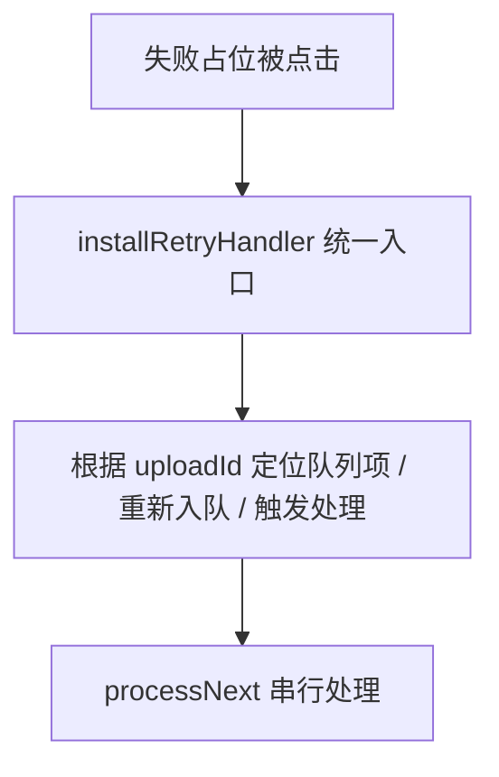

# 高层流程图（Mermaid）

本文档描述从粘贴图片到上传完成的端到端流程，以及调度器与命令的协作关系。用于团队沟通与回归验证。

## 1. 粘贴 → 占位 → 入队（绝对隔离阶段）

```mermaid
flowchart TD
    A[用户在编辑器粘贴图片] --> B[读取剪贴板/拖拽数据: mime, binary]
    B --> C[生成唯一ID uploadId]
    C --> D[写入本地临时文件 .assets/xxx.ext<br/>同名后缀重试，确保目录存在]
    D --> E[在编辑器插入占位 markdown<br/>携带 uploadId，图片用 ]
    E --> F[构造 QueueItem 并入队 saveData.uploadQueue<br/>path 保存 vault 相对路径]
    F --> G[结构化日志记录: id/path/size/base64Length]
```

关键点：
- 入队时 path 固定为 vault 相对路径（而非 app://），避免适配器读取失败
- 插入占位时仅在非临时模式才转换预览为 app 资源 URL；临时模式保留本地路径
- 本阶段不触发异步上传，彻底隔离

## 2. 处理队列（命令 / 调度器）

```mermaid
flowchart TD
    Q[队列有待处理项?] -->|否| Q2[空闲]
    Q -->|是| R[processNext(plugin)]
    R --> R1[读取 base64: optimistic 缓存优先]
    R1 -->|未命中| R2[通过 adapter.readBinary(path) 读取本地文件<br/>剥离 ?query 串]
    R2 --> R3[若仍失败 → 标记失败占位，保留队列项，结束]
    R1 --> R4[构造对象 key<br/>makeObjectKey 或兜底使用 id]
    R4 --> R5[performUpload 上传至 S3]
    R5 -->|成功| R6[替换占位为最终 URL<br/>图片保持  形式]
    R6 --> R7[删除临时文件（尽力而为）]
    R7 --> R8[清理 optimistic 缓存]
    R8 --> R9[saveQueue 出队]
    R5 -->|失败| R10[替换为失败占位，保留队列项]
```

设计要点：
- 幂等：仅在上传成功后出队
- 健壮：剥离 path 上的查询串；缓存/本地双路径
- 用户可见：成功/失败 Notice；控制台结构化日志

## 3. 调度器最小实现（手动启动）

```mermaid
flowchart LR
    S1[用户执行 Scheduler: Start] --> S2[createQueueScheduler 单例 start()]
    S2 --> S3[每 2500ms tick 一次]
    S3 -->|running 且 !inFlight| S4[调用 processNext(plugin)]
    S4 --> S5[处理 0/1 条后释放 inFlight]
    S3 -->|Stop| S6[停止 tick，清 interval]
```

规则：
- 单实例：命令侧维护，避免重复创建
- 不自动启动：尊重手动控制
- 每次 tick 仅处理 1 条，inFlight 并发保护

## 4. 生命周期与清理

```mermaid
flowchart TD
    L1[index.onload] --> L2[注册命令/监听]
    L2 --> L3[不自动 start 调度器]
    L3 --> L4[index.onunload]
    L4 --> L5[若 scheduler 存在且 running → stop()]
    L5 --> L6[释放 interval 等句柄]
```

要点：
- 所有监听使用 this.registerXxx 托管
- 单例由命令持有；onunload 做幂等 stop，避免幽灵定时器

## 5. 失败与重试入口（规划）



后续计划：
- 合并各处重试逻辑到 installRetryHandler，统一交互与日志
- 与调度器配合，确保不会重复消费

## 6. 关键文件索引

- 粘贴与入队：[src/paste/installPasteHandler.ts.installPasteHandler()](src/paste/installPasteHandler.ts:1)
- 手动/调度复用处理：[src/queue/processNext.ts.processNext()](src/queue/processNext.ts:1)
- 最小调度器：[src/scheduler/queueScheduler.ts.createQueueScheduler()](src/scheduler/queueScheduler.ts:1)
- 命令注册与调度器单例：[src/commands/registerCommands.ts.registerCommands()](src/commands/registerCommands.ts:1)
- 失败占位与缓存工具：[src/uploader/optimistic.ts](src/uploader/optimistic.ts:1)
- 生命周期（入口）：[src/index.ts.onload()](src/index.ts:1) / [src/index.ts.onunload()](src/index.ts:1)