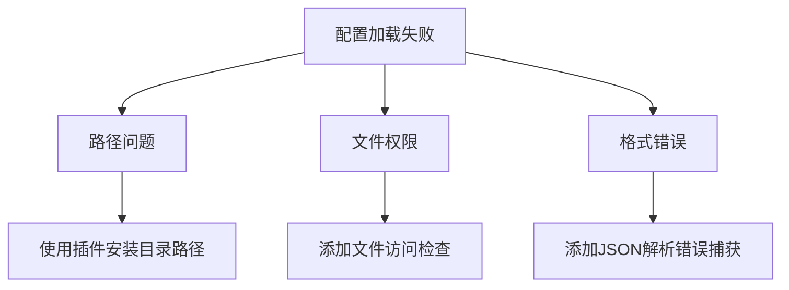

# Obsidian S3 插件里程碑总结

## 核心功能实现

1. **配置管理**
   - 通过设置面板管理 S3 连接信息
   - 配置持久化存储到 `config/s3Config.json`
   - 支持 Endpoint、Access Key、Secret Key 等关键参数

2. **连接测试**
   - 一键测试 S3 连接
   - 验证存储桶访问权限
   - 上传测试图片并生成访问 URL
   - 完整验证连接、上传、下载流程

3. **架构设计**
   - 模块化设计：配置加载器、设置面板、核心逻辑分离
   - 错误处理机制：配置文件缺失、格式错误、权限问题等
   - 类型安全：使用 TypeScript 接口定义配置结构

## 关键排错经验

### 路径问题解决方案

1. 使用正确路径格式：`${this.app.vault.configDir}/plugins/${this.manifest.id}/config/s3Config.json`
2. 添加路径日志输出调试
3. 确保目录存在：使用 `fs.mkdirSync` 创建缺失目录

### 文件权限问题

1. 添加 `fs.accessSync` 检查文件可读性
2. 捕获权限错误并提供友好提示
3. 确保 Obsidian 有权限访问配置文件

### 格式错误处理

1. 使用 try/catch 捕获 JSON 解析错误
2. 提供详细的错误消息
3. 返回默认配置避免插件崩溃

## 重要经验

1. **路径处理**：在 Obsidian 插件中，使用正确的路径构建方式至关重要
2. **错误处理**：对文件操作进行全面错误捕获，提供用户友好提示
3. **调试技巧**：添加详细日志帮助定位问题
4. **安全存储**：使用 .gitignore 保护敏感配置信息
5. **连接测试**：实现完整的上传/下载流程验证功能完整性

## 后续计划

1. 实现图片上传功能
2. 添加图片管理界面
3. 支持多种文件类型上传
4. 开发本地缓存同步机制
