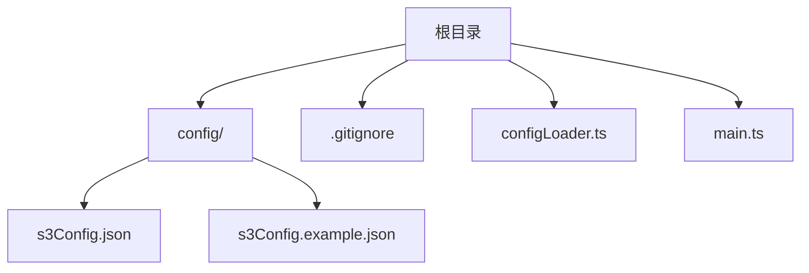

# Obsidian S3 插件配置模块实施计划

## 目标
创建配置模块用于存储和管理 S3 对象存储连接信息，支持插件安全使用 AWS S3 兼容服务。

## 文件结构


## 详细步骤

### 1. 创建配置文件夹
- 路径：`config/`
- 命令：`mkdir config`

### 2. 创建配置文件
- **s3Config.json** (实际配置文件)
  ```json
  {
    "endpoint": "https://your-s3-endpoint.com",
    "accessKeyId": "your-access-key",
    "secretAccessKey": "your-secret-key",
    "bucketName": "your-bucket-name",
    "region": "optional-region",
    "useSSL": true
  }
  ```
- **s3Config.example.json** (示例模板)
  ```json
  {
    "endpoint": "",
    "accessKeyId": "",
    "secretAccessKey": "",
    "bucketName": "",
    "region": "",
    "useSSL": true
  }
  ```

### 3. 更新.gitignore
- 添加以下内容防止敏感信息泄露：
  ```
  /config/s3Config.json
  ```

### 4. 实现配置加载器 (configLoader.ts)
```typescript
import * as fs from 'fs';
import * as path from 'path';

export interface S3Config {
  endpoint: string;
  accessKeyId: string;
  secretAccessKey: string;
  bucketName: string;
  region?: string;
  useSSL: boolean;
}

export function loadS3Config(): S3Config {
  const configPath = path.join(__dirname, '../config/s3Config.json');
  
  if (!fs.existsSync(configPath)) {
    throw new Error('S3配置文件不存在，请创建config/s3Config.json');
  }

  const rawData = fs.readFileSync(configPath, 'utf-8');
  const config = JSON.parse(rawData) as S3Config;
  
  // 验证必要字段
  if (!config.endpoint || !config.accessKeyId || !config.secretAccessKey || !config.bucketName) {
    throw new Error('S3配置文件缺少必要字段');
  }
  
  return config;
}
```

### 5. 集成到主文件 (main.ts)
```typescript
import { loadS3Config } from './configLoader';

// 在插件初始化时加载配置
export default class S3Plugin {
  private config: S3Config;

  async onload() {
    try {
      this.config = loadS3Config();
      console.log('S3配置加载成功');
      // 初始化S3客户端...
    } catch (error) {
      console.error('配置加载失败:', error.message);
    }
  }
}
```

### 6. 测试方案
1. 创建测试配置文件
2. 添加单元测试验证：
   - 配置文件存在性检查
   - 字段验证逻辑
   - 错误处理流程

## 后续开发路线
1. 实现S3客户端模块
2. 创建文件上传功能
3. 开发Obsidian设置面板
4. 添加图片上传后本地缓存管理